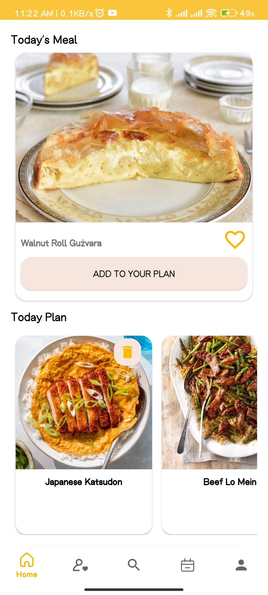

# Food Planner Android App

**Description:**
The Food Planner Android app is your culinary companion, designed to make meal planning and cooking a delightful experience. This app allows users to search for meals, access detailed recipes, plan their monthly meals, and more. Here's an overview of its features and the technologies used.

## Features

1. **Meal Search:**
   - Search for meals by name, ingredients, category, and area of origin.

2. **Detailed Meal Information:**
   - View complete details for each meal, including ingredients and step-by-step instructions.
   - Watch instructional cooking videos for each meal.

3. **Favorites:**
   - Add meals to your list of favorite dishes for quick access.

4. **Meal Planning:**
   - Plan your entire month by scheduling meals for specific days.

5. **User Modes:**
   - The app supports both guest and registered user modes.
   - Some features are available exclusively to registered users.

6. **Registration:**
   - Users can register using their email and password.
   - Alternatively, they can register quickly and securely using their Google account.

## Technologies Used

- **Programming Language:** Java
- **API Requests:** Retrofit
- **Data Source:** TheMealDB API
- **Navigation:** Navigation Component
- **Local Caching:** Room Database
- **Concurrency and Threading:** RxJava with Retrofit and Room
- **Animations:** Lottie for animations and splash screen
- **Authentication:** Firebase Auth and Realtime Database
- **Cloud Storage:** Firestore for local cache synchronization
- **Architecture Pattern:** MVP (Model-View-Presenter)
- **UI Design:** Google Material Design components
